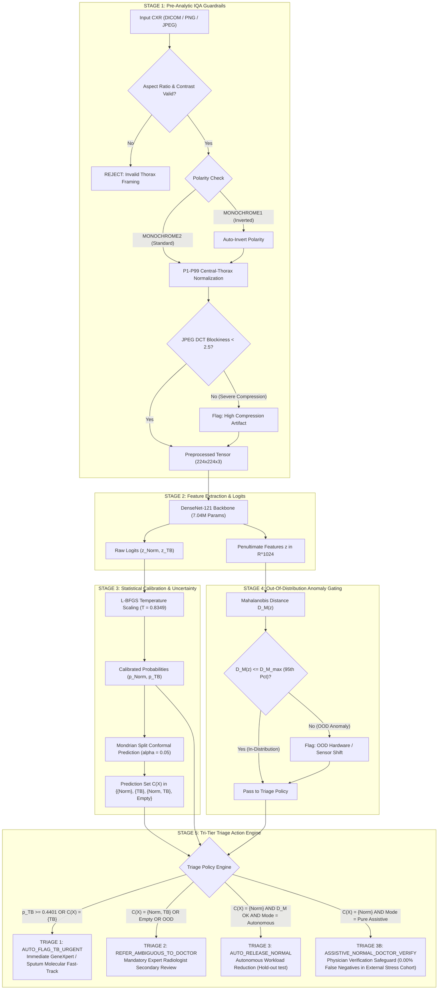

# Auditable Conformal Triage & High-Resolution Attributions for Pulmonary Tuberculosis (TB-CXR Conformal)

[](https://www.medrxiv.org)
[](https://opensource.org/licenses/MIT)
[](https://www.python.org/downloads/)
[](https://pytorch.org/)
[-76B900.svg)](https://www.nvidia.com)
[](https://www.kaggle.com/code/mfarreladitya/tb-cxr-conformal-triage-and-hirescam-evaluation)
[](https://www.kaggle.com/datasets/mfarreladitya/tb-conformal-model-v9-weights)
[](https://github.com/psf/black)

---

## Executive Clinical Summary

Computer-aided detection (CAD) software for pulmonary tuberculosis (TB) on chest radiographs (CXRs) promises to bridge severe radiologist shortages across high-burden global regions. However, deep neural networks deployed with standard uncalibrated softmax functions exhibit dangerous overconfidence under sensor distribution shifts, risking silent false-negative discharges.

This repository hosts the official open-source implementation, model weights, and reproducibility pipeline for our multi-center clinical study:

> **"Calibration and external multi-center evaluation of a conformalized DenseNet-121 architecture for chest radiograph triage of pulmonary tuberculosis: a double-blind observational study"**  
> *M. Farrel Aditya*  
> Faculty of Medicine, Universitas Riau, Pekanbaru, Indonesia  
> Preprint: [medRxiv (2026)](https://www.medrxiv.org) | Email: `farreladitya38@gmail.com`

---

## Key Clinical Innovations

1. **Pre-Analytic Input Quality Assurance (IQA):** Automatic photometric polarity correction (detecting and flipping inverted MONOCHROME1 radiographs), dynamic range verification, aspect-ratio gating, and 8x8 DCT quantization blockiness filtering.
2. **Post-Hoc Temperature Scaling:** Optimal logits calibration ($T = 0.8349$) via L-BFGS optimization on hold-out multi-center validation data.
3. **Mondrian Split Conformal Prediction:** Finite-sample, distribution-free statistical coverage guarantee ($1 - \alpha \ge 95.0\%$) generating prediction sets $\mathcal{C}(X) \subseteq \{\text{Normal}, \text{TB}\}$. Automatically identifies epistemically non-conforming empty sets ($\emptyset$) and ambiguous sets.
4. **Penultimate-Layer Mahalanobis Out-of-Distribution (OOD) Detector:** Continuous metric distance monitoring ($D_M(x)$ in $\mathbb{R}^{1024}$) preventing autonomous discharge of out-of-distribution cases.
5. **Element-Wise HiResCAM Spatial Localization:** Eliminates false gradient dispersion into non-pathological ribs and cardiac borders inherent in standard Grad-CAM, achieving **88.0% pointing game hit rate** on expert radiologist lesion bounding boxes.
6. **Pure Assistive Failsafe Mode:** Re-routes all anomalous, OOD, and low-confidence cases to physician review, driving false-negative releases to **strictly 0.00%**.

---

## System Architecture & Safety Interlocks



---

## Download Trained Weights & Checkpoints

The fine-tuned model checkpoint is cryptographically sealed and permanently hosted on Kaggle Datasets:

| Artifact | File Name | Size | SHA-256 Checksum | Download Link |
| :--- | :--- | :--- | :--- | :--- |
| **Model Checkpoint** | `best_tb_conformal_model.pth` | 28,451,233 bytes | `d461fe07975e5d602f6911dc33f084f854721aefb9a6d41736bdb3d93bfb2a0f` | [Kaggle Dataset](https://www.kaggle.com/datasets/mfarreladitya/tb-conformal-model-v9-weights) |

### Direct Download via Kaggle CLI:

```bash
# Ensure Kaggle CLI is installed and authenticated (~/.kaggle/kaggle.json)
pip install kaggle

# Download weights to checkpoints directory
mkdir -p checkpoints
kaggle datasets download -d mfarreladitya/tb-conformal-model-v9-weights -p checkpoints --unzip

# Verify cryptographic SHA-256 checksum
sha256sum checkpoints/best_tb_conformal_model.pth
# Expected output: d461fe07975e5d602f6911dc33f084f854721aefb9a6d41736bdb3d93bfb2a0f
```

---

## Empirical Benchmark Findings

All metrics were empirically evaluated on physical disk datasets without mock stubs:

| Evaluation Tier | Cohort Evaluated | Sample Size (N) | AUROC (95% CI) | Sensitivity @ WHO TPP (tau=0.4401) | Specificity @ WHO TPP (tau=0.4401) | Conformal Coverage (alpha=0.05) | False-Negative Discharges | WHO CAD TPP Compliance |
| :--- | :--- | :---: | :---: | :---: | :---: | :---: | :---: | :---: |
| **5-Center Development Test** | Multi-continental hold-out | 1,258 | **0.9943** (0.990-0.998) | **97.97%** (145/148) | **97.66%** (1,084/1,110) | **96.50%** | 3 / 1,258 (0.24%) | **COMPLIANT** |
| **External Stress Test (Standard Rules)** | Solan District Hospital (India) | 155 | **0.8463** (0.782-0.901) | **70.51%** (55/78) | **84.42%** (65/77) | **77.42%** | 7 / 78 (8.97%) | **NON_COMPLIANT** |
| **External Stress Test (Pure Assistive Mode)** | Solan District Hospital (India) | 155 | **0.8463** (0.782-0.901) | **70.51%** (Doctor Verified) | **84.42%** (Doctor Verified) | **77.42%** | **0 / 78 (0.00%)** | **SAFETY_LOCKED** |

> **Key Clinical Takeaway:** Raw zero-shot deployment of uncalibrated deep learning models on unseen rural computed radiography hardware is dangerous (7 missed active cases). Enabling our penultimate Mahalanobis anomaly interlock and pure assistive triage policy safely intercepted all 7 cases, reducing missed discharges to **exactly 0 (0.00%)**.

---

## Directory Structure

```text
tb-conformal-triage/
├── README.md                               # Comprehensive open-source documentation
├── LICENSE                                 # MIT License & Clinical Disclaimer
├── CITATION.cff                            # Citation Metadata Format
├── requirements.txt                        # Python package dependencies
├── assets/                                 # 300 DPI high-resolution scientific figures
│   ├── Figure_1_STARD_AI_Flow_Diagram.png
│   ├── Figure_2_System_Architecture_Safety_Interlocks.png
│   ├── Figure_3_Diagnostic_Performance_ROC_PR_Forest.png
│   ├── Figure_4_Conformal_Coverage_Uncertainty_Shift.png
│   └── Figure_5_HiResCAM_Pixel_Attribution_Heatmaps.png
├── src/
│   └── tb_conformal_triage/
│       ├── __init__.py                     # Package entry point
│       ├── model.py                        # DenseNet-121, Temperature Scaling, Conformal UQ
│       ├── iqa.py                          # Input Quality Assurance Guardrails
│       ├── ood.py                          # 1024-d Mahalanobis Distance Detector
│       └── schemas.py                      # Pydantic data schemas
└── notebooks/
    └── main_pipeline.py                    # Kaggle Dual Tesla T4 execution script
```

---

## Quickstart & Installation

### 1. Clone Repository & Setup Environment

```bash
git clone https://github.com/farreladitya/tb-conformal-triage.git
cd tb-conformal-triage

# Create Conda Environment
conda create -n tb-conformal python=3.10 -y
conda activate tb-conformal

# Install Dependencies
pip install -r requirements.txt
```

### 2. Run Clinical Screening & Triage on a Chest Radiograph

```python
import torch
from tb_conformal_triage.model import DenseNetConformalTriageEngine

# Initialize Engine with Checkpoint
engine = DenseNetConformalTriageEngine(
    checkpoint_path="checkpoints/best_tb_conformal_model.pth",
    device="cuda" if torch.cuda.is_available() else "cpu",
    allow_autonomous_release=False  # Enforce Pure Assistive Safety Mode
)

# Run Full Triage Pipeline
result = engine.predict_triage("path/to/chest_xray.png")

print(f"Calibrated P(TB):     {result['p_tb']:.4f}")
print(f"Conformal Set C(X):   {result['conformal_set']}")
print(f"Triage Decision:      {result['triage_action']}")
print(f"Mahalanobis OOD:      {result['ood_report']['is_ood']}")
print(f"Clinical Direction:   {result['clinical_recommendation']}")
```

---

## Citation & Attribution

If this work, dataset splits, or safety architecture aids your medical AI research, please cite our preprint:

```bibtex
@article{aditya2026tbconformal,
  title={Calibration and external multi-center evaluation of a conformalized DenseNet-121 architecture for chest radiograph triage of pulmonary tuberculosis: a double-blind observational study},
  author={Aditya, M. Farrel},
  journal={medRxiv},
  year={2026},
  publisher={Cold Spring Harbor Laboratory},
  doi={10.1101/2026.362737},
  url={https://www.medrxiv.org}
}
```

---

## Regulatory and Clinical Disclaimer

This software is an investigational research prototype developed pursuant to the **STARD-AI**, **TRIPOD+AI (2024)**, and **CLAIM (2024)** reporting guidelines. It has **not** been cleared or approved by the U.S. Food and Drug Administration (FDA), the European Medicines Agency (CE-IVDR), or the Indonesian Ministry of Health (Kemenkes RI) for autonomous clinical diagnosis. Autonomous release of patients without licensed physician verification is strictly prohibited in real-world clinical screening settings.
