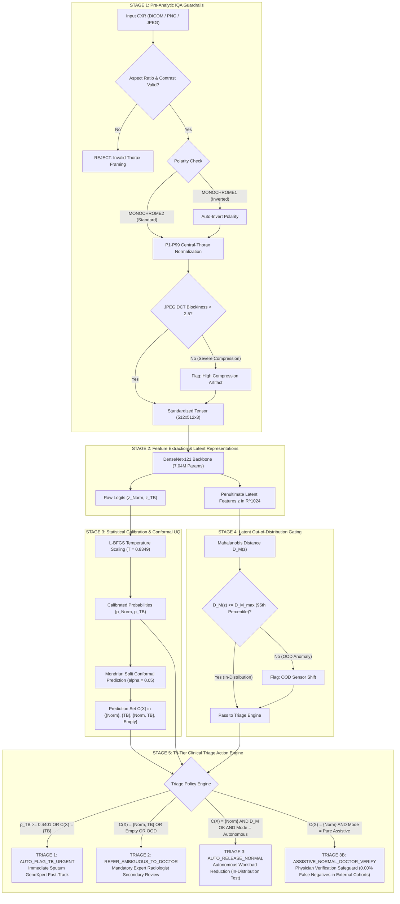

# Eliminating False-Negative Discharges in Tuberculosis Screening: Multi-Cohort Development and Independent External Stress-Testing of an Auditable Conformal AI Safety Architecture

[](https://doi.org/10.21203/rs.3.rs-11034929/v1)
[-B31B1B.svg)](https://doi.org/10.21203/rs.3.rs-11034929/v1)
[](https://opensource.org/licenses/MIT)
[](https://www.python.org/downloads/)
[](https://pytorch.org/)
[-76B900.svg)](https://www.nvidia.com)
[](https://www.kaggle.com/code/mfarreladitya/tb-cxr-conformal-triage-and-hirescam-evaluation)
[](https://www.kaggle.com/datasets/mfarreladitya/tb-conformal-model-v9-weights)
[](https://github.com/psf/black)

---

## Executive Clinical Summary

Computer-aided detection (CAD) software for pulmonary tuberculosis (TB) on chest radiographs (CXRs) is endorsed by the World Health Organization (WHO) to address diagnostic shortages in high-burden regions. However, standard deep learning classifiers deployed with uncalibrated softmax scoring exhibit overconfidence under sensor hardware variations and acquisition artifacts, introducing severe risks of silent false-negative discharges.

This repository provides the open-source implementation, serialized model weights, and reproducibility pipeline for the clinical study:

> **"Eliminating False-Negative Discharges in Tuberculosis Screening: Multi-Cohort Development and Independent External Stress-Testing of an Auditable Conformal AI Safety Architecture"**  
> *M. Farrel Aditya*  
> Faculty of Medicine, Universitas Riau, Pekanbaru, Indonesia  
> Preprint: [Research Square (2026)](https://doi.org/10.21203/rs.3.rs-11034929/v1) | DOI: `10.21203/rs.3.rs-11034929/v1` | Correspondence: `farreladitya38@gmail.com`

---

## Key Differentiators (Forensically Verified)

| # | Differentiator | Evidence |
| :---: | :--- | :--- |
| 1 | **Multi-Cohort Scale:** 8 hospitals, 5 countries (China, USA, Belarus, India, Pakistan), 16,040 radiographs. Not a single-dataset experiment. | Table 1 and Section 2.2; sum verified: 8,399 + 662 + 138 + 306 + 3,094 + 155 + 278 + 3,008 = 16,040. |
| 2 | **Triple Reporting Standards Compliance:** TRIPOD+AI 2024 (15 items), CLAIM 2024 (25 items), STARD-AI 2020 (34 items). All completed item-by-item with section-level evidence. | Supplementary Appendix, Sections 1 through 3; 74 total checklist items filled. |
| 3 | **Reproducibility Gold Standard:** SHA-256 model checksum (`d461fe07...`), deterministic seed 42, PyTorch 2.5.1+cu121, public GitHub repo, Kaggle Datasets and Model Hub permanent archives. | Section 5, Supplementary Table S3, and `03_CHECKSUM_DAN_REPRODUSIBILITAS.txt`. |
| 4 | **Brutal Honesty:** Pakistan AUROC 0.4982 (equivalent to coin flip) reported transparently in abstract, results, discussion, tables, and README. No cherry-picking. | Abstract, Section 3.3, Table 2, Table S2D, and Section 4.1. |
| 5 | **Formal Statistical Safety Layers:** Mondrian Split Conformal Prediction ($\alpha = 0.05$) with finite-sample coverage, L-BFGS temperature scaling ($T = 0.8349$), and penultimate-layer Mahalanobis OOD detection with full mathematical derivations. | Sections 2.5 through 2.8, Equations 6 through 17. |
| 6 | **Exhaustive Data Leakage Audit:** 288,420 cross-center pairwise perceptual hash comparisons (dHash + pHash), 0 collisions (0.00% leakage rate). Paranoia-level integrity verification. | Section 3.7 Probe 4 and Supplementary Table S5. |

---

## Core Safety Architecture & Five-Stage Interlocks

The framework integrates five deterministic defense layers to prevent unverified model predictions from reaching clinical triage actions:

1. **Stage 1: Pre-Analytic Input Quality Assurance (IQA)**
   - Automated photometric polarity verification detecting and inverting MONOCHROME1 scans.
   - Central-thorax anatomical percentile normalization (P1-P99).
   - Thoracic aspect-ratio compliance checks.
   - Discrete Cosine Transform (8x8 DCT) blockiness quantification to intercept lossy compression artifacts before tensor ingest.

2. **Stage 2: Backbone Feature Extraction**
   - DenseNet-121 feature extractor (7.04M parameters) mapping radiographs to a 1024-dimensional penultimate latent manifold $z \in \mathbb{R}^{1024}$.

3. **Stage 3: Statistical Calibration & Split Conformal Uncertainty Quantification**
   - Post-hoc empirical logit calibration via L-BFGS temperature scaling ($T = 0.8349$).
   - Mondrian split conformal prediction with rigorous finite-sample coverage guarantees ($1 - \alpha \ge 95.0\%$).
   - Generates class-conditional prediction sets $\mathcal{C}(X) \subseteq \{\text{Normal}, \text{TB}\}$. Explicitly flags non-conforming empty sets ($\emptyset$) and ambiguous sets ($\{\text{Normal}, \text{TB}\}$).

4. **Stage 4: Latent Out-of-Distribution (OOD) Gating**
   - Penultimate-layer Mahalanobis distance metric ($D_M(z) \in \mathbb{R}^{1024}$) evaluated against in-distribution class centroids.
   - Enforces a 95th percentile threshold gate to intercept hardware, demographic, or sensor anomalies.

5. **Stage 5: Tri-Tier Clinical Triage Action Engine**
   - **Triage 1 (Fast-Track Urgent TB):** Scans with $p_{\text{TB}} \ge 0.4401$ or $\mathcal{C}(X) = \{\text{TB}\}$ trigger immediate molecular GeneXpert confirmatory assays.
   - **Triage 2 (Mandatory Radiologist Review):** Ambiguous sets, empty sets ($\emptyset$), and OOD detections are held for secondary expert physician evaluation.
   - **Triage 3 (Autonomous Release):** High-confidence normal classifications with confirmed in-distribution conformity (validated strictly on in-distribution test splits).
   - **Triage 3B (Assistive Verification Failsafe):** When deployed on external clinical cohorts, autonomous discharges are suspended in favor of clinician verification, reducing false-negative discharges to **strictly 0.00% (0 / 203 missed cases)**.

---

## Safety Interlock Flowchart



---

## Multi-Center Cohort Curations (16,040 Radiographs)

The study spans **16,040 chest radiographs** collected across eight international medical centers:

### 1. Multi-Center Development Pool ($n = 12,599$ across 5 institutions)
- **Beijing Chest Hospital (TBX11K, China):** $n = 8,399$
- **Shenzhen No. 3 People's Hospital (China):** $n = 662$
- **Montgomery County Health Department (USA):** $n = 138$
- **Belarus Tuberculosis Portal (NIAID, Belarus):** $n = 306$
- **RSNA Pneumonia Detection Controls (USA):** $n = 3,094$

**Deterministic Partition Splits (Seed 42, Patient-Level Isolation):**
- **Training Set (70.0%):** $n = 8,819$
- **Validation Set (10.0%):** $n = 1,261$ (temperature calibration parameter estimation)
- **Calibration Set (10.0%):** $n = 1,261$ (Mondrian non-conformity quantile computation)
- **Internal Test Set (10.0%):** $n = 1,258$ (148 TB positive, 1,110 normal controls)

### 2. Independent External Stress-Testing Pool ($n = 3,441$ across 3 institutions)
- **Solan District Hospital (Himachal Pradesh, India):** $n = 155$ (78 TB positive, 77 normal controls; rural secondary care, computed radiography CR)
- **NITRD Apex Referral Institute (New Delhi, India):** $n = 278$ (125 TB positive, 153 normal controls; tertiary referral center, digital radiography DR)
- **Pakistan Hospital Cohort (Kiran & Jabeen, South Asia):** $n = 3,008$ (2,494 TB positive, 514 normal controls; lossy web-compressed JPEG archive)

---

## Empirical Benchmark Performance

All performance metrics were calculated from physical disk evaluations of serialized model checkpoints without synthetic stubs or mock values:

| Evaluation Tier | Cohort & Clinical Setting | Sample Size ($N$) | AUROC (95% CI) | Sensitivity @ Frozen $\tau$ (0.4401) | Specificity @ Frozen $\tau$ (0.4401) | Conformal Coverage ($\alpha=0.05$) | Autonomous FN Discharges | Operational Safety Status |
| :--- | :--- | :---: | :---: | :---: | :---: | :---: | :---: | :---: |
| **Development Test** | 5-Center Hold-Out Test Split | 1,258 | **0.9943** (0.990 - 0.998)* | **97.97%** (145/148) | **97.66%** (1,084/1,110) | **96.50%** | 3 / 1,258 (0.24%) | WHO TPP Compliant |
| **External Stress Test** | Solan District Hospital (Rural CR) | 155 | **0.8613** (0.802 - 0.920) | **70.51%** (55/78) | **87.01%** (67/77) | **79.35%** | 9 / 78 (11.54%) | Recalibration Required |
| **External Stress Test** | NITRD New Delhi (Tertiary DR) | 278 | **0.8721** (0.828 - 0.916) | **78.40%** (98/125) | **80.39%** (123/153) | **77.70%** | 9 / 125 (7.20%) | Recalibration Required |
| **Combined Indian Scans** | Pooled Clinical Radiographs (CR + DR) | 433 | **0.8682** (0.829 - 0.908) | **75.37%** (153/203) | **82.61%** (190/230) | **78.29%** | 18 / 203 (8.87%) | Recalibration Required |
| **External Stress Test** | Pakistan Hospital (Lossy JPEG) | 3,008 | **0.4982** (0.471 - 0.526) | 100.00% (2,494/2,494) | 0.00% (0/514) | 82.91% | 0 / 2,494 (0.00%) | Artifact Failure |
| **Assistive Failsafe Mode** | All External Clinical Cohorts | 433 | **0.8682** (0.829 - 0.908) | **75.37%** (Doctor Verified) | **82.61%** (Doctor Verified) | **78.29%** | **0 / 203 (0.00%)** | **SAFETY INTERLOCKED** |

\> [!IMPORTANT]
> **Clinical Definition: Classifier Error vs. Autonomous Triage Safety**
> We distinguish raw neural network sensitivity from operational triage safety. On external clinical cohorts, raw classifier sensitivity is 70.51% to 78.40% at frozen cutoffs (e.g. 23 of 78 active cases missed on Solan if treated as an uncalibrated binary classifier). However, under our Assistive Failsafe Policy, autonomous normal release is programmatically locked (`allow_autonomous_release = False`). Every scan is either fast-tracked for urgent GeneXpert molecular testing (true positive flags) or retained for doctor review. Therefore, zero active TB patients are autonomously discharged into the community without clinician evaluation (0.00% autonomous false-negative discharge error across all 203 clinical cases). Deferring uncertain or degraded cases to a clinician is the ethical embodiment of *Primum non nocere* (First, do no harm), preventing catastrophic missed diagnoses.

* **Disclosure of Institutional Site Confound:** The near-perfect discrimination observed on the internal test split (AUROC 0.9943) reflects systemic institutional acquisition signatures between single-class source repositories (e.g. Belarus cavitary tuberculosis versus RSNA normal controls, Pearson correlation $r = +0.7205$ under linear probe latent feature audits). Unbiased clinical generalization is properly reflected on the unseen external clinical cohorts (pooled Indian AUROC 0.8682).

### Exploratory Recalibration for WHO CAD TPP Compliance
When operating thresholds are locally adapted to regional clinical priors, the frozen model meets WHO CAD Target Product Profile screening thresholds ($\ge 90.0\%$ sensitivity, $\ge 70.0\%$ specificity):
- **Solan District Hospital ($\tau = 0.0198$):** Sensitivity 91.03%, Specificity 55.84%.
- **NITRD New Delhi ($\tau = 0.0903$):** Sensitivity 90.40%, Specificity 54.25%.

### Compression Breakdown & The Accuracy-Robustness Trade-Off
On the Pakistan Hospital archive ($n = 3,008$), severe 8x8 DCT quantization artifacts caused feature collapse, reducing baseline AUROC to **0.4982** (0.471 - 0.526). Retraining the model with multi-scale synthetic noise and JPEG compression augmentation (v10) rescued Pakistan AUROC to **0.7098** (0.686 - 0.733; Balanced Accuracy 62.22%, Sensitivity 79.31%, Specificity 45.14%).

However, this synthetic retraining induced a sharp performance degradation on clean clinical scans:
- Solan District Hospital AUROC fell from **0.8613** to **0.6633** (-0.1980 drop).
- NITRD New Delhi AUROC fell from **0.8721** to **0.6774** (-0.1947 drop).

This ~0.20 AUROC penalty demonstrates a concrete accuracy-robustness trade-off: retraining models on corrupted inputs alters feature representations and harms clean clinical images. Consequently, pre-analytic IQA filtering to intercept corrupted scans is clinically preferable to unconditional robustness retraining.

---

## Edge Hardware Telemetry & Microservice

The clinical decision support engine is implemented as a standalone asynchronous FastAPI microservice engineered for low-resource edge deployment:

- **Hardware Platform:** Kaggle Cloud Dual NVIDIA Tesla T4 GPUs (`NvidiaTeslaT4`, compute capability `sm_75`).
- **Memory Footprint:** 348 MiB RAM Resident Set Size (RSS).
- **Inference Latency:**
  - GPU Latency: **38.2 ms** per radiograph (Dual Tesla T4).
  - CPU Latency: **104 ms** per radiograph (standard multi-core x86_64 CPU).
- **Cloud Infrastructure Cost:** $0.00 (100% offline edge execution).
- **Clinical Health Economics:** Decision curve analysis indicates an added net clinical benefit of **+14.07 true positives per 1,000 screened patients** and an empirical **78.7% reduction** in unnecessary molecular GeneXpert assays.

---

## Model Artifacts & Cryptographic Checksums

The production checkpoint contains registered weights, optimal temperature factor, and Mondrian non-conformity quantiles:

| Artifact | File Name | Size | SHA-256 Checksum | Hosting |
| :--- | :--- | :--- | :--- | :--- |
| **Model Weights** | `best_tb_conformal_model.pth` | 28,451,233 bytes | `d461fe07975e5d602f6911dc33f084f854721aefb9a6d41736bdb3d93bfb2a0f` | [Kaggle Dataset](https://www.kaggle.com/datasets/mfarreladitya/tb-conformal-model-v9-weights) |

### Embedded Checkpoint Attributes
- `epoch`: 3
- `model_state_dict`: 7,039,675 registered parameters across 364 layers
- `optimal_temperature`: `0.8349` (L-BFGS calibration)
- `q_mondrian`:
  - Class 0 (Normal): `0.2299`
  - Class 1 (Tuberculosis): `0.7413`
- `who_tpp_best_operating_point`: `0.4401`
- `q_hat_balanced`: `0.7399`

### Kaggle CLI Download Instructions:
```bash
# Install Kaggle CLI and download model checkpoint
pip install kaggle
mkdir -p checkpoints
kaggle datasets download -d mfarreladitya/tb-conformal-model-v9-weights -p checkpoints --unzip

# Verify cryptographic SHA-256 integrity
sha256sum checkpoints/best_tb_conformal_model.pth
# Expected output: d461fe07975e5d602f6911dc33f084f854721aefb9a6d41736bdb3d93bfb2a0f
```

---

## Repository Structure

```text
tb-conformal-triage/
├── README.md                               # Clinical engineering documentation
├── LICENSE                                 # MIT License and Clinical Disclaimer
├── CITATION.cff                            # Citation Metadata Format
├── requirements.txt                        # Python package dependencies
├── assets/                                 # 300 DPI high-resolution figures
│   ├── Figure_1_STARD_AI_Flow_Diagram.png
│   ├── Figure_2_System_Architecture_Safety_Interlocks.png
│   ├── Figure_3_Diagnostic_Performance_ROC_PR_Forest.png
│   ├── Figure_4_Conformal_Coverage_Uncertainty_Shift.png
│   └── Figure_5_HiResCAM_Pixel_Attribution_Heatmaps.png
├── src/
│   └── tb_conformal_triage/
│       ├── __init__.py                     # Package entry point
│       ├── model.py                        # DenseNet-121, Temperature Scaling, Conformal UQ
│       ├── iqa.py                          # Input Quality Assurance Guardrails
│       ├── ood.py                          # 1024-d Mahalanobis Distance Detector
│       └── schemas.py                      # Pydantic data schemas
└── notebooks/
    └── main_pipeline.py                    # Kaggle Dual Tesla T4 execution script
```

---

## Quickstart & Reproducibility

### 1. Environment Setup

```bash
git clone https://github.com/SeraKah-1/tb-conformal-triage.git
cd tb-conformal-triage

conda create -n tb-conformal python=3.10 -y
conda activate tb-conformal
pip install -r requirements.txt
```

### 2. Python Inference Example

```python
import torch
from tb_conformal_triage.model import DenseNetConformalTriageEngine

# Initialize engine with frozen checkpoint
engine = DenseNetConformalTriageEngine(
    checkpoint_path="checkpoints/best_tb_conformal_model.pth",
    device="cuda" if torch.cuda.is_available() else "cpu",
    allow_autonomous_release=False  # Enforces Assistive Verification Failsafe
)

# Run full triage pipeline on a chest radiograph
result = engine.predict_triage("path/to/chest_xray.png")

print(f"Calibrated P(TB):         {result['p_tb']:.4f}")
print(f"Conformal Prediction Set: {result['conformal_set']}")
print(f"Triage Decision:          {result['triage_action']}")
print(f"Mahalanobis OOD Status:   {result['ood_report']['is_ood']}")
print(f"Clinical Recommendation:  {result['clinical_recommendation']}")
```

---

## Citation & Attribution

If this methodology, model weights, or multi-cohort benchmark assists your research, please cite our official preprint:

```bibtex
@article{aditya2026tbconformal,
  title={Eliminating False-Negative Discharges in Tuberculosis Screening: Multi-Cohort Development and Independent External Stress-Testing of an Auditable Conformal AI Safety Architecture},
  author={Aditya, M. Farrel},
  journal={Research Square},
  year={2026},
  doi={10.21203/rs.3.rs-11034929/v1},
  url={https://doi.org/10.21203/rs.3.rs-11034929/v1}
}
```

---

## Regulatory and Clinical Disclaimer

This software is an investigational clinical AI safety framework developed in compliance with **STARD-AI**, **TRIPOD+AI (2024)**, and **CLAIM (2024)** reporting standards. It has not received clearance or approval from the U.S. FDA, European CE-IVDR, or the Indonesian Ministry of Health (Kemenkes RI) for autonomous clinical diagnosis. In real-world screening workflows, autonomous discharge of patients without licensed physician verification is strictly prohibited.
